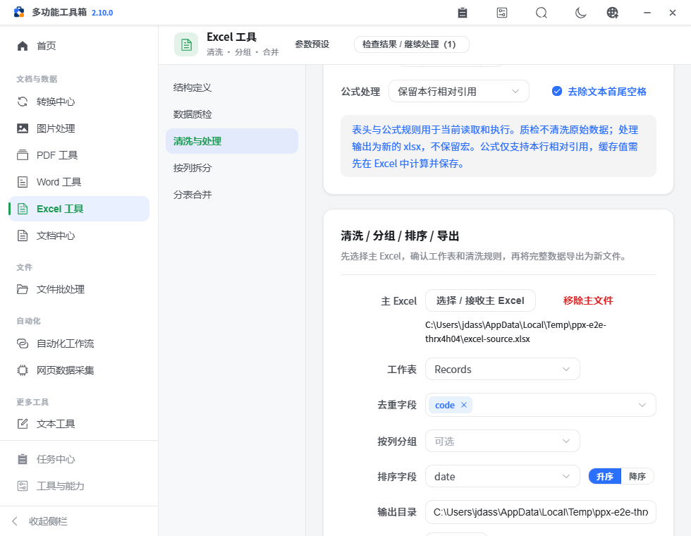
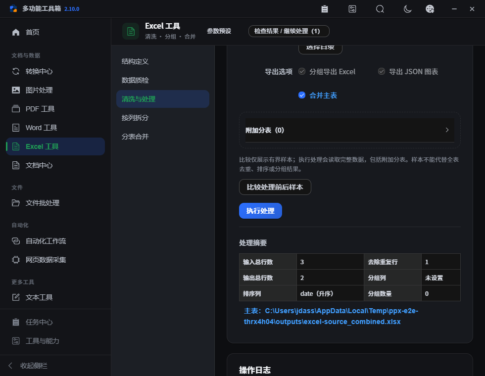

# PPX v2.10.0 — 表格处理与单表接力

本版把“上一步工作簿 → 质检 → 清洗 → 拆分”的主输入和处理规则明确呈现在 Excel 工具中，同时修复样本比较、字段保留、合并清洗与异步输入切换问题。

## 已完成

- 新增 `excel/profile`、`excel/process`、`excel/split` 三个单工作簿接力目标，支持 `.xlsx/.xlsm/.xltx/.xltm`。总计 18 个目标；CSV、JSON 和旧 XLS 需先转换。
- 质检、清洗、拆分页面均可直接选择或接收主文件。主文件变化后清除旧字段、比较、统计与输出；保留输出目录，附加分表选择不会消费主输入接力。
- 读取规则明确区分用途：质检与拆分读取原数据；清洗与合并按各自配置处理。删除 `callApi` 中的隐式全局 Excel 草稿注入，所有面板显式传参。
- 样本与完整处理共用同一套保留类型的清洗、去重和排序。修复日期先转字符串导致排序不同、公式元数据丢失和下划线字段被隐藏的问题。
- 合并表格在字段映射后执行清洗；完整处理返回输入行数、输出行数和去重删除数，样本返回自己的删除数。
- 错误持续显示在对应面板；改变输入或规则后拒绝迟到响应；重新读取清除旧分析和导出结果。
- 短窗口中长输出路径可换行，输出动作支持标准键盘操作；保留明暗主题与现有工作台布局。
- 自动发版从真实已推送标签读取注释，核对标签提交与构建提交一致，再生成 Release 说明。

## 使用方式

1. 在任务结果里选一份工作簿，选择“清洗 Excel”，在目标页点击“选择 / 接收主 Excel”。也可直接选择本地文件。
2. 确认表头行和工作表；根据需要选择去空格、去重字段、排序、分组和输出目录。附加分表在折叠区添加。
3. 点击“比较处理前后样本”，检查字段与规则，再点击“执行处理”处理完整数据。结果中核对输入、输出、去重数量并打开文件。
4. 需要质量报告时，将数据文件交给“Excel 数据质检”；需要分发分组时交给“拆分 Excel”。接收本身不执行任务。

## 输入输出与边界

| 项目 | 约定 |
| --- | --- |
| 表头 | 默认第 1 行，可明确指定；字段名为空或重复时按既有规则生成唯一名称 |
| 清洗顺序 | 合并附加表 → 去除文本首尾空格 → 按选中字段去重（保留首条）→ 排序 → 分组/导出 |
| 数据类型 | 保留数字、日期、前导零文本、原本以等号开头的文本；数值/日期/文本按类型排序，空值置后 |
| 公式 | 仅保留本行相对引用并随行移动调整；复杂引用需先在 Excel 中计算保存后选缓存值策略，缺缓存明确报错 |
| 样本 | 默认 30 行，最高 100 行，且仅含主文件；明确不等同全表去重、排序、分组，也不包含附加分表 |
| 输出 | 写入新 XLSX 数据表，不保留宏；源文件不变，已有输出按统一命名冲突规则避让 |
| 异常 | 不可读文件、未知字段/工作表、错误映射、无公式缓存等显示原因；失败和陈旧响应不恢复旧结果 |

## 验证

本地验证证据见 [verification.json](assets/v2.10.0/verification.json)。针对性 Python 回归覆盖表头第 2 行、日期混合排序、前导零、相对公式平移、公式样文本、下划线字段、映射合并、去重、错误参数与样本边界。浏览器通过真实 API 生成并读取清洗、报告和拆分产物，同时验证旧响应隔离与短窗口明暗主题。

发布前执行前端/Python 静态检查、71 项 Python 回归、12 项接力规则测试和完整浏览器流程；推送提交后再通过 GitHub Actions 完成三平台检查与打包，随后以单个 `v2.10.0` Tag 触发自动 Release。

## 未完成与原因

- 接力来源追踪、把已确认链路保存为工作流预设，继续在后续版本设计和实现；本版集中完成表格处理的正确性与主输入。
- 样本不做完整公式计算、宏保留、跨行引用重写或任意格式推断，这些会超出当前数据表处理契约。
- 本机未安装 OCR 运行时，相应路由本地验证不可用时的禁用状态；依赖齐全环境另行验证接收与识别。
- 三平台真实安装、原位升级、恢复、异常退出及完整文件变体人工验收仍保持 [pending](../refactor-acceptance.json)。源码验证与打包通过不能替代原生安装验收。
