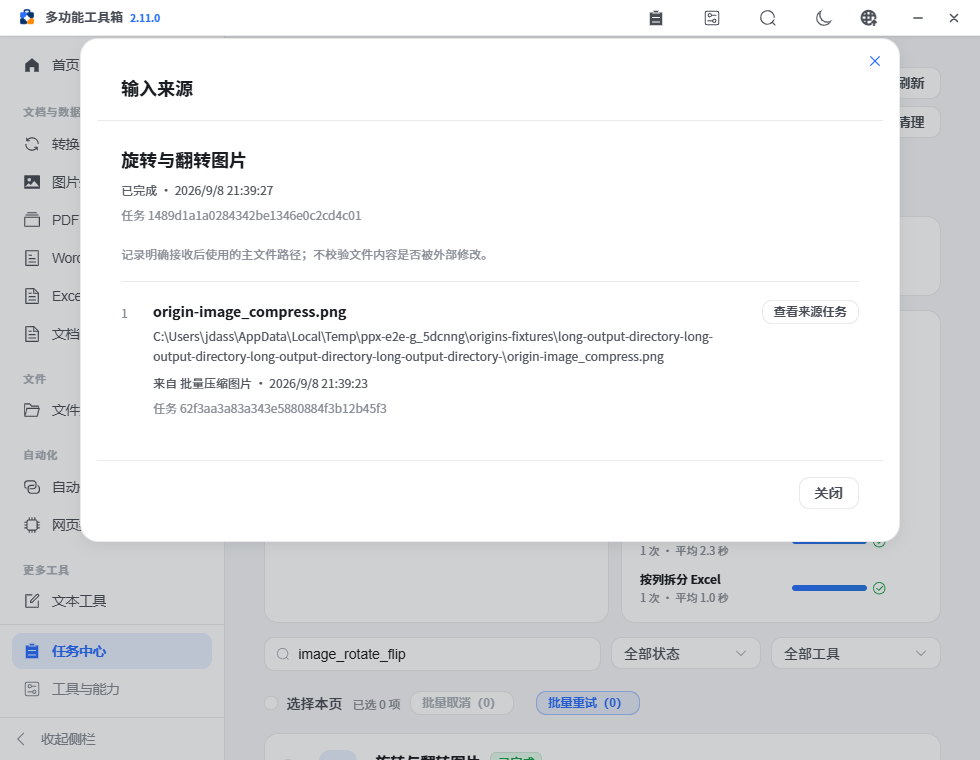
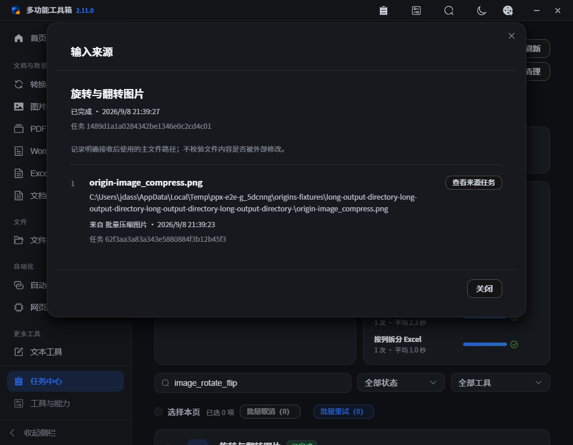
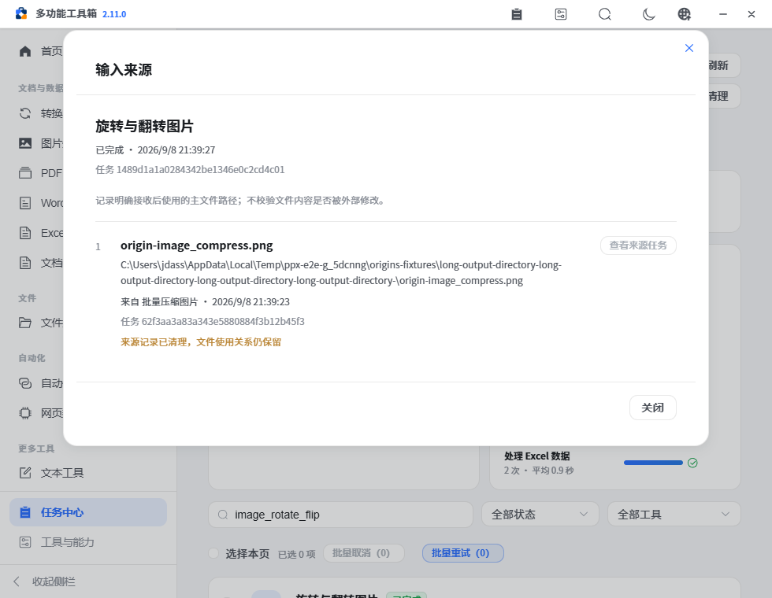

# PPX v2.11.0 — 接力来源与任务追踪

本版让多步文件处理有迹可查：从任务结果接收文件并执行后，下游任务会记录明确使用的来源文件和来源任务。用户可以逐层查看处理经过；更换输入、部分失败重试和历史清理都有对应规则。

## 已完成

- 18 个接收目标的执行点接入来源提交；Excel 质检是只读分析，导出报告时记录其主工作簿来源。
- 文件对象携带来源并随实际输入增删；普通文件选择不按路径查找或猜测来源。同一路径移除后重新本地选择，也不会沿用旧来源。
- 来源独立放在任务元数据中。后端核对主输入字段、来源任务存在及输出路径匹配；客户端提供的名称和时间不能冒充后端来源摘要。
- 任务中心新增“输入来源”：显示输入路径、来源操作和时间，可以打开不在当前筛选/分页的来源任务，逐层查看并返回。
- 来源任务中的结果仍可继续接力；发送后来源弹窗关闭，不会遮挡目标工具。
- 区分 `retryOf` 重试关系和文件来源；部分失败重试只保留剩余输入的已验证来源。父任务后来清理时，下游关系仍保留，显示记录不可再打开。
- 来源随任务保存到本机数据库，重启可恢复；源任务参数和结果内容不复制进来源记录。参数预设和工作区配置排除来源元数据。
- JSON 导出保留完整来源字段，CSV 增加重试任务、来源任务和来源路径列。

## 核心使用流程

1. 在任务结果中选择兼容操作并接收主文件，预览或修改参数后执行。
2. 打开任务中心，在新任务里点击“输入来源”，核对用了哪个文件、来自哪个任务。
3. 点击“查看来源任务”检查上一步；有更早的明确来源时可以继续查看，点击“返回上一任务”回到当前链路。
4. 需要换文件时直接在原工具改选或移除输入；再次执行只记录仍在主输入中的来源。

## 契约与异常

| 情况 | 行为 |
| --- | --- |
| 主输入 | 由操作目录的 `primaryInputFields` 明确声明，支持单路径、文件数组和 `tables.path` 等嵌套字段 |
| 辅助输入 | 水印图、字体、目录展开得到的文件、Excel 附加表不自动记作本版主来源 |
| 提交 | `inputOrigins` 放在 `task_submit` 顶层；工具业务参数保持原格式 |
| 校验 | 输入必须属于本次实际主文件，来源任务必须记录了同一规范化文件路径；Windows 路径大小写/斜杠等价 |
| 无效来源 | 剔除并保存可查看的中文说明，不阻止文件业务运行；最多处理 200 个候选来源，超出会明确说明 |
| 清理前后 | 新提交时父记录已清理则不新增未经验证来源；已验证下游任务仍保留关系，内部重试可沿用剩余输入的快照 |
| 重试 | 仅剩余失败输入保留来源，`retryOf` 单独记录；含敏感或过大参数的重试限制沿用既有规则 |
| 界面 | 异步查看只应用最新请求；关闭或返回后旧响应不跳转；长路径换行，来源列表分页，短窗口保留操作按钮 |

来源是**明确接收并使用的文件路径关系**，不证明文件内容未被外部替换，也不提供内容哈希或完整工作流自动还原。早期任务和普通本地选择没有接力来源记录。

## 验证

本地证据见 [verification.json](assets/v2.11.0/verification.json)。新增 6 组后端测试覆盖真实输出接力、主/辅助输入隔离、路径规范化、伪造/无效来源、部分失败重试、父清理和重启、敏感参数限制。新增 4 项前端纯函数测试覆盖普通选择、输入替换、去重、快照和有界提交。

浏览器通过真实 API 执行图片压缩/旋转/水印、Excel 质量报告和文档索引，检查输入来源和实际产物；验证筛选外来源查询、返回、父结果再接力、同路径本地重选、来源清理后提示与配置存储隔离。静态检查、77 项 Python 回归、16 项前端规则测试及完整工作区浏览器流程纳入发布检查，GitHub Actions 再完成三平台检查与打包。

## 未完成与后续

- 从人工接力自动还原工作流、内容哈希、辅助材料来源与超过 200 项的完整来源索引继续评估，优先完成高频可复用流程，避免新增独立执行引擎。
- 本机 OCR 运行时不可用，PDF OCR 来源执行未做本地真实识别；接收点已接入，后端契约与缺依赖禁用有检查。
- 三平台真实安装、升级、恢复和完整人工验收仍保持 [pending](../refactor-acceptance.json)。自动化源码与打包检查不替代这些原生验收。
