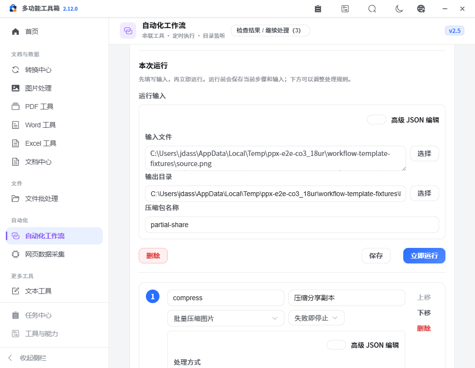
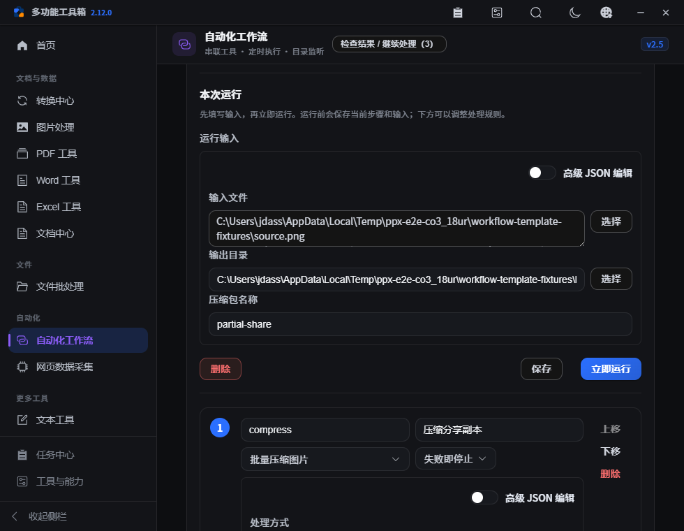
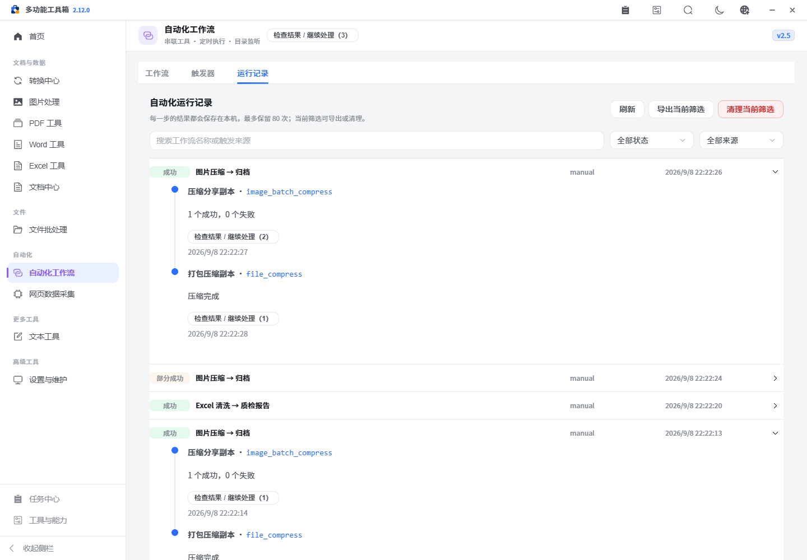

# PPX v2.12.0 — 常用工作流与可靠续跑

本版把重复的图片交付和表格检查整理成可编辑、可重复运行的模板。沿用现有工作流引擎、任务队列和结果操作，补齐参数执行、部分成功处理及结果查看的完整流程。

## 已完成

- 新增“图片压缩 → 归档”：选择图片和输出目录，填写压缩包名，先生成压缩副本，再将这些副本打包为 ZIP。默认质量 82，可在步骤里修改。
- 新增“Excel 清洗 → 质检报告”：读取指定表头行，清除文本首尾空格，可按所选字段去重，导出清洗副本，再为副本生成质量报告。
- 两个模板都保留源文件，创建模板不会执行处理，也不会启用定时或目录监听。输入文件默认留空，用户选择后手动运行。
- “本次运行”输入移至步骤配置前。立即运行先校验并保存当前步骤和输入，避免执行旧参数；无效 JSON 不进入队列。
- 运行和保存期间禁用普通、嵌套及高级参数编辑，避免异步完成时覆盖刚改的输入。
- `paths` 类型正确引用上一步 `outputPaths`，文件归档可以通过表单串联图片输出；Excel 操作目录补齐去空格和去重字段。
- 新增独立的“部分成功即停止/继续”规则。两个新模板默认停止，保留成功文件；不将缺少文件的结果继续打包。已有工作流默认继续，保持原行为。
- 工作流运行记录支持逐步检查结果并继续交给其它工具。能找到对应队列任务时，接力来源使用队列任务 ID。
- 修复无密码归档被误判为不可重试。空密码和空默认值不会阻断重试；真实密码、令牌、空格字符串和非空容器仍脱敏并禁止用不完整历史重试。

## 使用方式

1. 打开“自动化工作流”，选择对应内置模板并点击“使用模板”。
2. 在“本次运行”选择输入、输出目录和必要参数；需要调整质量或其它规则时，在下方编辑对应步骤。
3. 点击“立即运行”。保存和参数校验通过后，任务进入现有持久队列。
4. 在运行记录查看各步骤及产物；需要额外处理时打开“检查结果 / 继续处理”。
5. 部分失败时先修复缺失文件或权限等原因，再到任务中心重试。只重做失败部分；先前成功步骤的产物必须仍在，且工作流步骤未改变。

## 输入、输出和异常契约

| 流程 | 输入和处理 | 输出 | 异常处理 |
| --- | --- | --- | --- |
| 图片压缩 → 归档 | 图片列表、输出目录、压缩包名；质量默认 82；压缩副本的路径数组传入归档 | 每张压缩副本 + ZIP | 任意图片失败形成部分成功时停止归档；已生成文件保留；修复后重试补齐 |
| Excel 清洗 → 质检报告 | 主工作簿、原表表头行、输出目录、去空格开关、去重字段列表 | 清洗 XLSX + 含质量概览/字段画像/质量问题的报告 XLSX | 原表读取失败、字段不存在或写入失败按步骤报告；不会继续生成无效报告 |
| 表头与去重 | 原表表头可在第 2 行等位置；清洗副本统一以第 1 行为表头供报告读取 | 保持类型的清洗结果；空去重列表表示不去重 | 不把原表行号误用到新副本；不默认删除重复行 |
| 参数保存 | 立即运行先保存当前编辑；步骤参数与运行输入仍按现有结构持久化 | 可再次打开、修改并运行的工作流 | 无效 JSON 或字段校验失败时不提交执行任务 |
| 部分成功规则 | `onPartial: stop/continue` 独立于 `onError` | 保留当前步骤与此前完成的产物 | 新模板停止；旧工作流缺省继续；取消行为沿用现有队列 |
| 恢复 | 任务中心根据原运行 ID 与步骤签名续跑，复用成功项 | 补齐后的完整结果 | 步骤变更、成功产物移动/删除时拒绝沿用，需重新运行 |

Excel 报告检查的是清洗后的副本。需要了解原始数据的重复和空值状况时，先用 Excel 数据质检单独检查原表。公式和宏限制沿用 Excel 工具既有说明，不承诺原样保存复杂工作簿布局。

## 验证

本地记录见 [verification.json](assets/v2.12.0/verification.json)。Python 回归共 85 项，前端规则测试共 20 项；静态检查、生产构建及完整浏览器工作区流程纳入发布检查。GitHub Actions 对 Windows、macOS、Linux 分别检查并打包。

新增真实文件测试检查 PNG 副本与 ZIP 内容、源文件字节不变、第二行表头清洗后从第一行生成报告、部分失败停止与补齐后续跑、成功项时间戳不变，以及无密码归档的实际失败和重试。

浏览器验证从模板创建和文件选择开始，检查当前未保存参数执行、路径数组引用、错误 JSON 阻止任务、工作流结果接力的队列来源、真实 Excel 数据与报告、部分成功提示、任务中心续跑和短窗口布局。

## 未完成与扩展方向

- 从人工接力历史自动生成工作流、复杂字段映射、并行分支与智能推荐未纳入本版；先保证可解释的顺序模板可靠运行。
- 创建的工作流仍使用现有参数持久化和模板包契约；导出分享前检查文件路径和敏感字段。新模板不包含密码参数。
- 原生三平台安装、升级、恢复及完整人工验收仍为 [pending](../refactor-acceptance.json)；本地 OCR 缺依赖的范围仍单独记录。
