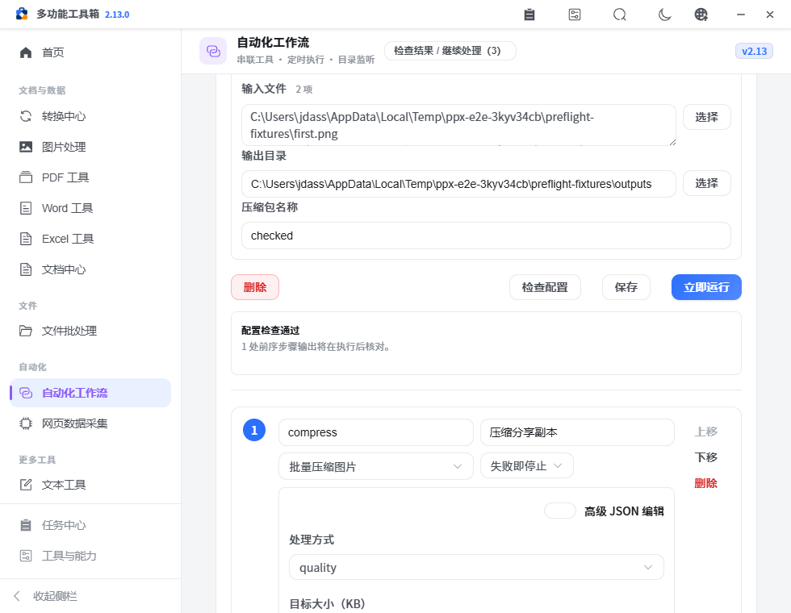
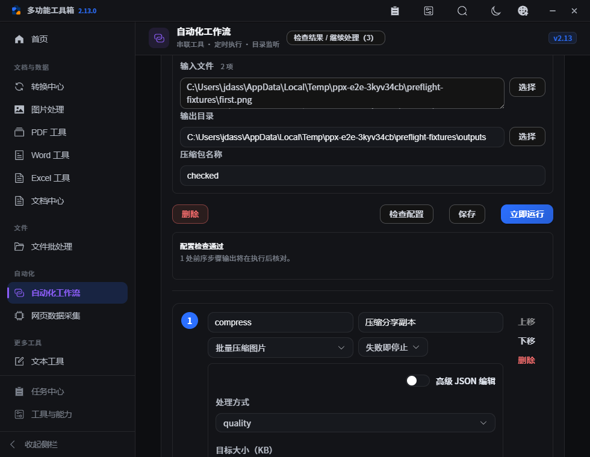
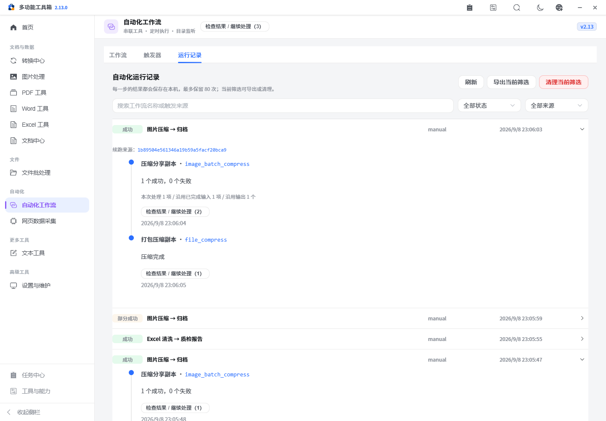

# PPX v2.13.0 — 执行前检查与恢复说明

本版让工作流在处理文件前发现配置问题，并把续跑时本次处理与沿用的结果分别说清楚。复用现有操作目录、绑定解析器和任务队列，没有增加运行依赖。

## 已完成

- 新增“检查配置”：只读检查当前步骤和运行输入，不保存、不入队、不生成或读取文件内容。
- 必填字段、已知数字/开关/列表类型、输入下标、自引用、未来或缺失步骤、重复步骤 ID 和未知变量来源都有明确错误。可定位到对应步骤或实际运行输入。
- 前序步骤的自定义结果尚未产生时列为待执行核对；不把推测当成已验证结果。绑定与运行共用解析语义，完整变量保持原类型，输入中的变量样式文本不会二次展开。
- 立即运行先检查，通过后保存当前编辑并执行；新建工作流可直接执行。检查失败或服务错误不提交任务，编辑后清除旧报告，迟到响应不会覆盖新配置。
- 检查有规模和展开体积限制；错误只展示前 100 条，真实总数和后续步骤有效性仍准确。
- 续跑历史持久记录来源运行 ID；本次实际记录的处理输入数、沿用成功输入数和沿用输出数分开展示。整步复用明确说明本次未重新执行，旧记录未知数量不冒充零。
- 文件批处理的失败项续跑也显示上述计数；同路径重新生成的输出不计为沿用。
- 包括部分成功步骤在内，先前生成的文件一旦移动或删除，会在创建新的运行前拒绝续跑，避免最终归档缺文件。
- 文件、目录、列表和表格参数显示条目数；切换到有效 JSON 时清除陈旧错误，`null` 等非法参数对象不会导致页面崩溃。
- 修正数字参数在加载、检查和运行后残留禁用标记的问题，辅助功能状态与实际输入状态同步。

## 核心使用方式

1. 在自动化工作流选择模板或新建步骤，填写“本次运行”。
2. 点击“检查配置”，按错误旁的“定位”修正；检查通过后，查看待执行核对的前序输出数量。
3. 点击“立即运行”，通过检查后保存当前配置并进入队列。运行中参数和切换入口禁用，避免改动被异步结果覆盖。
4. 部分失败时保留已生成文件，修复原因后在任务中心重试。在运行记录查看续跑来源和“本次处理 / 沿用输入 / 沿用输出”。

## 输入输出、异常与依赖

| 能力 | 输入及处理 | 输出及异常 |
| --- | --- | --- |
| 只读预检 | `{steps, input, watch}`；清理并校验步骤，再解析已知变量和字段类型 | `valid/errors/deferred/steps/errorCount/truncated`；错误含步骤索引、JSON Pointer 和原因，不回显敏感输入值 |
| 规模限制 | 最多 100 步、1000 处变量引用、10000 节点、12 层及 200 万字符；展开也有统一预算 | 超限明确停止检查，不入队；错误明细上限与真实错误数分开 |
| 前序依赖 | 只允许前序步骤；自定义输出字段保留动态含义 | 内容和字段在前序实际执行后核对；不擅自运行前序步骤 |
| 恢复信息 | 原运行记录、步骤签名、实际输入记录、仍存在的成果 | 来源运行 ID、整步复用标记和已知数量；缺记录保留未知；签名变化或成果缺失拒绝续跑 |
| 表单与检查状态 | 当前参数、外部工作流切换、异步检查/文件选择 | 编辑后报告失效；旧响应不会覆盖新值；高级参数可就地修正 |

预检不读取文件内容，也不保证路径权限、磁盘空间或 OCR/FFmpeg 等依赖可用；这些由模块和实际运行继续校验。手动检查不会改变已保存定时/目录监听的自动输入注入规则。

## 验证

本地验证记录与截图见 [verification.json](assets/v2.13.0/verification.json)。Python 回归 103 项，前端规则 20 项；静态检查、生产构建及完整浏览器工作区流程作为发布前检查。

新增回归覆盖不初始化持久化/不调用处理器、一次绑定与原类型、JSON Pointer、结构与规模边界、100 条以上错误、展开预算、敏感值不回显、真实部分失败续跑、丢失部分成果阻断及目录批次计数。

浏览器验证覆盖无效配置不保存和不入队、错误定位到运行输入、陈旧响应和服务错误、JSON 切换恢复、数组数量、真实 PNG→ZIP、新建直接执行以及 980×760 的浅色/深色布局。既有完整流程继续检查真实 Excel、输出接力、来源与任务中心续跑。

## 未完成与后续方向

- 尚未为任意前序输出增加静态字段推断，也不承诺检查运行时的文件内容；后续优先对齐操作目录与真实输入输出契约。
- 并行分支、自动生成工作流和隐式自动执行不在本版范围。
- 原生三平台安装、升级、恢复及完整人工验收仍为 [pending](../refactor-acceptance.json)。GitHub 三平台构建通过后才为本版打附注 Tag，自动发版完成后核对安装包及摘要。
