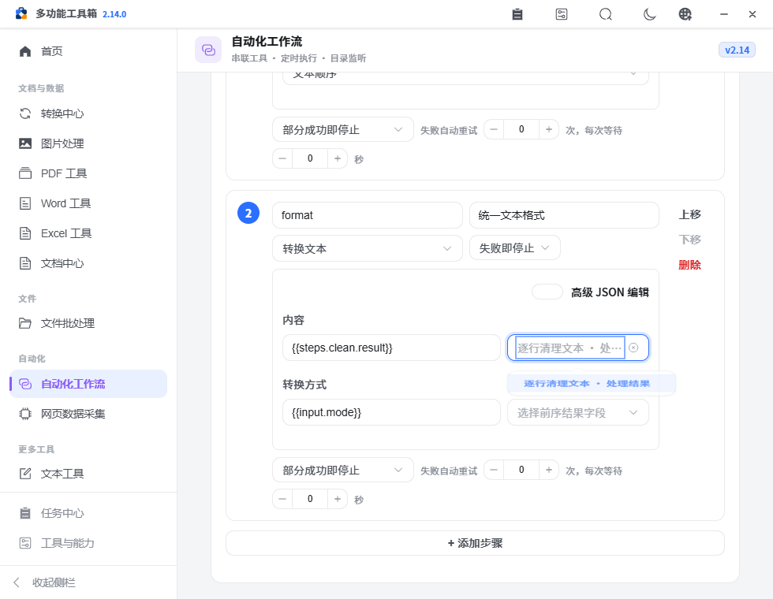
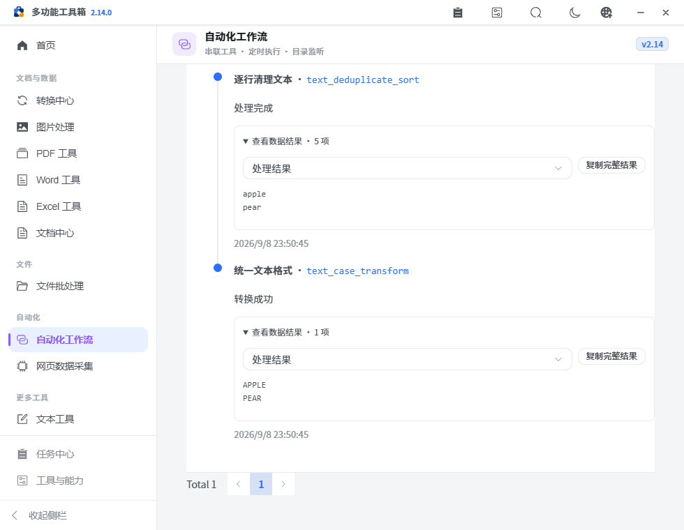
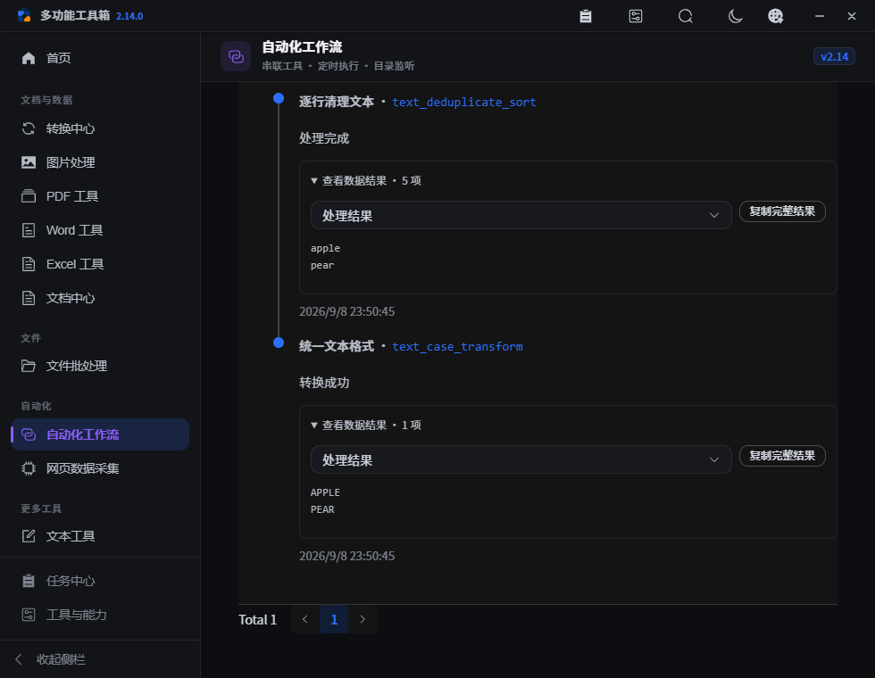

# PPX v2.14.0 — 结果字段与文本处理链路

工作流现在可以选择具体的前序结果字段，运行后查看并复制文本和结构化数据。新增“文本去重 → 统一格式”模板，让日常名单清理、标识整理与 JSON 处理进入同一工作台。

## 已完成

- 结果引用显示步骤名和字段名，按目标参数类型筛选。规范化文件结果提供文件列表、第一份文件和结果目录；文本与统计字段使用实际结果路径。
- 输出字段随操作模式变化：JSON 格式化、压缩、校验与查询各有对应类型；词频统计返回列表，去重和排序返回文本。运行参数尚未知时显示动态类型说明。
- 运行记录增加折叠的数据结果区域，打开后才渲染预览。文本、列表、对象、数字和开关可查看并复制；`0`、`false`、空字符串不再被视为没有结果。
- 长内容预览限制为 12000 个字符，复制仍使用完整值；截断避免拆开 Unicode 代理对，长行换行，沿用浅色和深色主题。
- 第五个内置模板接收多行文本，去除首尾空白、空行和重复行，再统一大小写或命名格式；使用既有队列、检查和运行记录。
- 文本转换、JSON 操作及排序方式改为实际支持的选项；JSON 查询路径使用文本输入。
- 替换规则要求 JSON 列表。编辑保留输入格式与光标，非法内容阻止运行，不再可能静默执行旧规则。
- 操作目录与 API/工作流白名单增加一致性回归；结果元数据返回副本，调用方不能改写全局声明。

## 使用流程与协作

1. 打开自动化工作流，使用“文本去重 → 统一格式”模板。
2. 在“本次运行”填写多行文本和转换方式。后续步骤的“选择前序结果字段”可选择“逐行清理文本 · 处理结果”。
3. 检查配置并立即运行；在运行记录打开每步的“查看数据结果”，选择文本或统计字段，按需复制。
4. 文件处理步骤继续使用既有结果接力；纯文本不会被包装成文件路径。

| 能力 | 输入、处理与输出 | 异常与边界 |
| --- | --- | --- |
| 字段选择 | `resultFields` 声明、前序步骤参数、目标字段类型 → 对应绑定 | 未声明字段可通过高级 JSON 配置；动态类型、可选输出和列表元素形状在实际执行时核对 |
| 文本模板 | 多行文本、转换方式 → 去重文本 → 转换文本 | 非文本输入和非法模式在预检阻断；文本处理错误停止后续步骤 |
| 数据结果 | 已存运行结果、声明字段路径 → 按需预览/完整复制 | 缺失字段不展示；空值保留类型语义；复制不可用时提示手动选择预览 |
| 参数编辑 | 当前 JSON 文本 → 有效结构或保留的非法文本 → 配置校验 | 不完整 JSON、对象代替规则列表、空必填规则明确报错 |

这些改进优先完成常用文本和文件链路；采用已有 Vue 组件、Python API、操作目录和绑定解析器，没有增加服务或运行依赖。

## 验证

Python 回归 108 项、前端字段规则 25 项、静态检查（147 条既有警告、0 错误）、生产构建和完整浏览器工作区验证均通过，页面错误为零；证据见 [verification.json](assets/v2.14.0/verification.json)。浏览器使用真实处理 API 验证文本模板、字段绑定、非法规则阻断、零/开关/空/长结果，以及短窗口浅色和深色布局。

复制验证使用浏览器内的临时剪贴板替身核对完整载荷，不覆盖开发电脑的剪贴板；不等于已验证所有原生系统的剪贴板权限。

## 未完成与扩展

- 任意动态 JSON 查询的完整静态类型推断、复杂列表映射和跨步骤表达式不在本版范围，保留真实运行核对。
- 下一批优先检查“搜索文件 → 打包归档”的匹配范围、搜索上限和目录监听行为，确保归档完整性。
- 原生三平台安装、升级、恢复和人工验收仍为 [pending](../refactor-acceptance.json)。三平台构建通过后打附注 Tag 触发自动发布，并核对安装包与发布说明。
