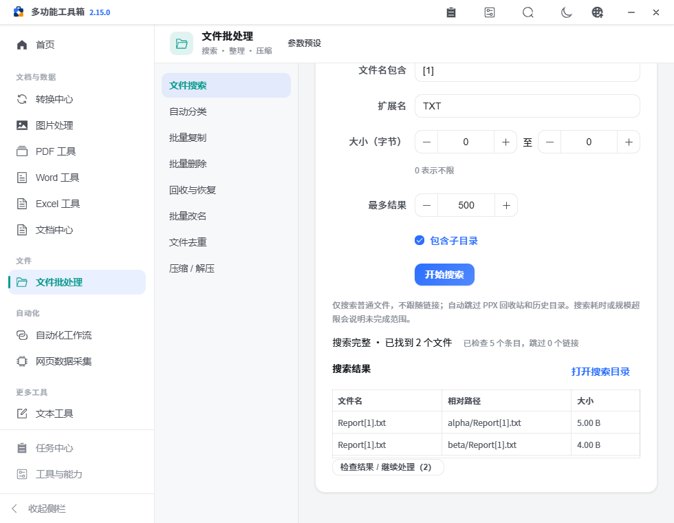
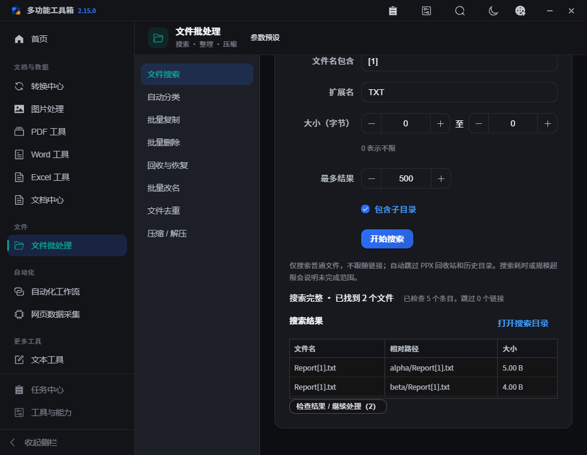
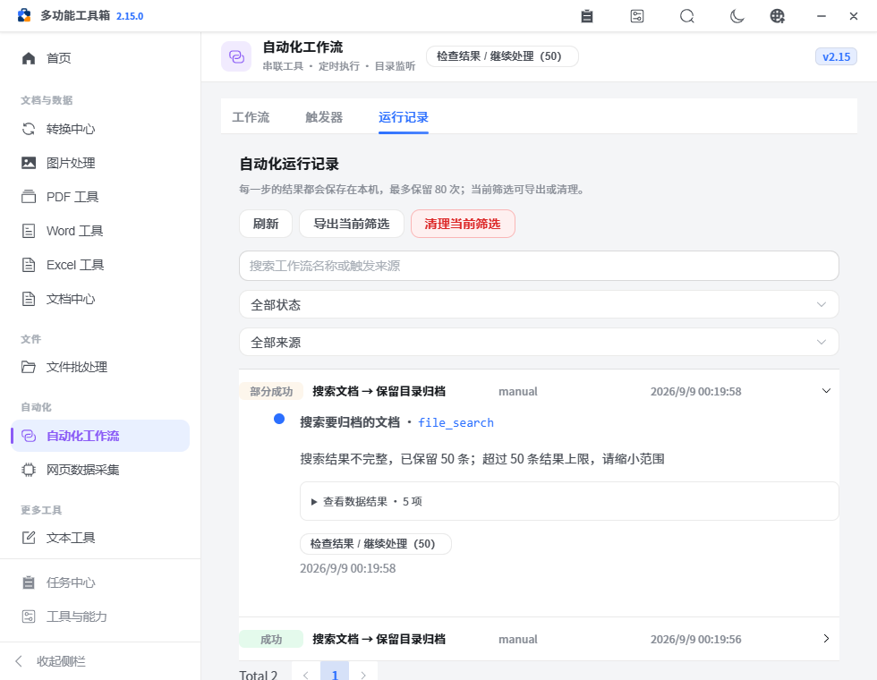

# PPX v2.15.0 — 完整搜索与相对路径归档

本版把“搜索文档 → 保留目录归档”做成可复用流程：先说明搜索是否完整，再按相对路径打包。同名文件可以保留各自目录，结果过多或读取失败时停止自动归档。

## 已完成

- 第六个内置模板按目录、关键字、扩展名和递归范围搜索文档，排除指定输出目录，完整匹配后再创建 ZIP。
- 搜索统一为本地有界扫描，不再因安装 fd 而改变字面匹配、子目录或忽略文件规则；包含隐藏文件，不跟随子链接和 Windows 联接点，排除 PPX 回收和历史目录。
- 修正数量上限传参错误；50–2000 条上限在全部筛选之后生效，发现额外一个匹配才标为截断，恰好达到上限不会误报。
- 搜索返回已找到数量、是否完整、截断状态、扫描量与未完成原因。权限等读取错误保留已找到文件，并明确标记不完整；自动模板停止后续归档。
- 搜索面板显示完整性、空结果和错误；改变条件清除旧结果，异步响应不会覆盖已改变的条件。已找到文件可经检查后交给既有兼容工具，不自动执行。
- ZIP/7Z 可指定共同根目录保留相对路径；同名成员、文件/目录冲突及根目录之外的输入阻断发布，不覆盖已有文件，也不留下半成品。
- 压缩包名称不得夹带目录；保留相对路径时需明确输出目录。界面从 7Z 切换为 ZIP 后不会继续提交已隐藏的 7Z 密码。
- 查询源文件不再加入工作流生成文件的监听排除名单。留存历史可确认的旧误标会修正，实际生成与无法判定的路径保留。

## 使用流程

1. 单次整理：文件批处理 → 文件搜索，选择目录及条件，检查完整性；打开“检查结果 / 继续处理”，选择兼容目标并接收文件，再显式执行。
2. 重复归档：使用“搜索文档 → 保留目录归档”模板，填写来源根目录、独立输出目录、扩展名及包名，检查并运行。输出目录可为来源中的专用子目录，模板会排除它；不能覆盖整个搜索范围。
3. 出现上限或读取错误时，缩小条件或解决读取问题再运行。最多结果代表已返回数量，不代表目录中的实际总量。
4. 手动压缩同名文件时，在“保留目录结构”选择共同根目录。检查归档中的相对路径，原始文件保持不变。

## 输入输出、异常与依赖

| 能力 | 输入与处理 | 输出和边界 |
| --- | --- | --- |
| 搜索 | 目录、文字包含、扩展名、范围与上限；可排除输出目录 | `items/outputPaths/matchedCount/complete/truncated/partial/errors/errorCount/scannedEntries/skippedLinks`；查询资产为来源文件 |
| 有界扫描 | 50 万条目、128 层、30 秒；每个目录及条目检查取消 | 超限不冒充完整；错误明细最多 20 项；系统调用之间协作检查时限 |
| 相对路径归档 | 输入列表、`baseDir`、输出目录、包名、ZIP/7Z | 同名文件按子目录区分；仅大小写不同也视为冲突；失败清理临时文件，保留已有归档 |
| 工作流 | 搜索的标准 `outputPaths` → 已有归档操作 | `onPartial=stop`，不完整列表不生成最终包；空结果也不会生成归档 |
| 监听与历史 | 已知查询名单、历史步骤结果、生成路径名单 | 源文件变化可继续触发监听；实际生成文件继续排除；历史无法确认的身份不猜测 |

实现复用现有队列、预检、工作区、结果接力和 Python 标准库目录扫描；归档继续使用已安装的 ZIP/py7zr 能力，没有新增运行依赖。

## 验证

130 项 Python 回归、25 项前端规则、静态检查（147 条既有警告、0 错误）、生产构建和完整浏览器工作区验证通过；具体结果见 [verification.json](assets/v2.15.0/verification.json)。新增真实文件验证覆盖字面关键字、非递归、过滤后上限、权限错误、预算、取消、相对路径、同名文件字节内容、ZIP/7Z 解包、旧历史修正和源文件监听事件。相对路径显示与最终布局调整另行通过定向浏览器检查。

浏览器检查搜索结果接力不执行、手动归档根目录、隐藏密码不误用、真实模板 ZIP、51 个匹配在上限 50 时停止且不新增归档，以及短窗口浅色和深色布局。

## 未完成与后续方向

- 超大网络目录和文件系统正在进行的阻塞调用不能由协作取消立即终止；继续明确预算和未完成状态，后续按真实大目录样本优化。
- 不新增任意脚本、自动推荐执行或全盘索引服务；继续检查常用操作参数与真实行为的一致性。
- 三平台原生安装、升级、恢复及人工验收仍为 [pending](../refactor-acceptance.json)。源码和自动链路验证不替代这些验收；附注 Tag 在三平台构建通过后创建并触发 GitHub 自动发布。
