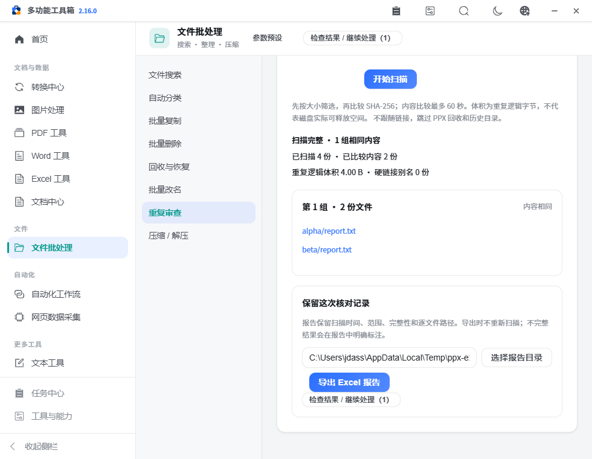
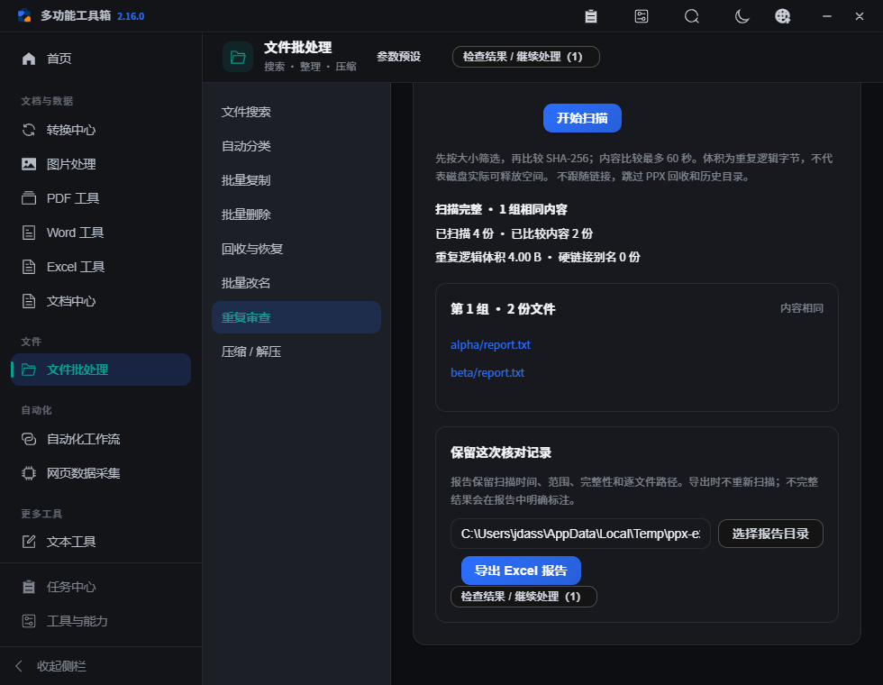
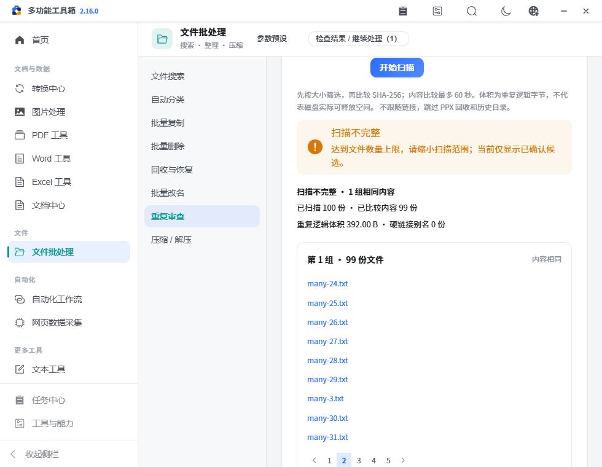
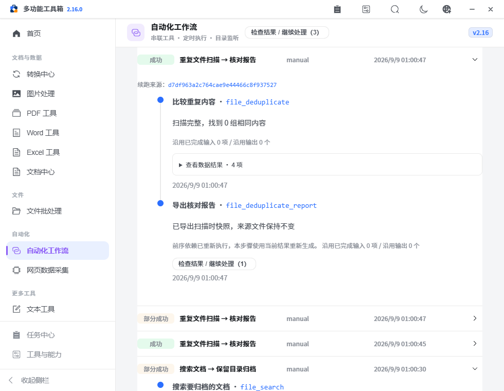

# PPX v2.16.0 — 重复文件审查与核对报告

本版把重复检测变成可核对的本地流程：先说明比较范围与可信边界，再将扫描时快照导出为 Excel，继续交给已有表格、索引或归档工具。来源文件保持不变。

## 已完成

- 修正重复检测数量上限传参错误，支持 100–20000 文件上限；使用统一目录扫描，明确完整、截断、读取错误与时间预算。
- 内容模式仅对同大小候选计算 SHA-256，唯一大小文件无需读取；读取前后检测来源变化，不可确认文件保留原因并标记不完整。
- 同名候选明确表示“未比较内容”，不再显示可释放空间。内容模式按独立身份估算重复逻辑字节，硬链接别名不重复计数，不将逻辑体积当作磁盘释放承诺。
- 扫描进入持久化任务队列，可在任务中心查看或取消；表单变更清除旧结果，异步响应有版本保护。
- 审查界面按分组浏览，每组每页最多 20 份文件，显示完整性、范围统计和错误；旧工作区不恢复过期扫描结果。
- 新增独立 Excel 报告动作，接收扫描分组与摘要，输出说明页及逐文件核对页。文字强制保留为文本，已有报告不覆盖；可显式导出标明不完整的快照。
- 第七个内置模板“重复文件扫描 → 核对报告”排除报告目录；仅完整扫描进入报告步骤。来源文件仍可触发监听，报告文件按生成结果排除。
- 修正用户选择“部分成功后继续”时的续跑一致性：查询重新扫描后不累计旧匹配，依赖重跑步骤的报告及后续归档重新生成；无关已完成步骤继续沿用，历史说明重新执行的原因。
- 核对全部 62 个操作的非空默认参数，修正音频提取“质量”字段误标为数字的问题；质量按已有后端的高、标准、较小选项提交。
- 安装包核验补齐打包细节：Windows 固定文件版本与产品版本同步；Debian 按实际构建架构声明并在打包后检查架构、版本。Linux 安装后只刷新可用的应用菜单数据库，不再猜测登录用户或向其桌面复制文件。

## 使用方式

1. 文件批处理 → 重复审查，选择目录、扩展名、递归范围和上限。
2. 选择“比较内容”寻找相同内容，或“同名候选”核对目录中相同名称的文件；扫描后逐组查看。
3. 检查完整性与原因，选择报告目录并导出 Excel。报告中的内容代表扫描时快照，导出不会再次核验文件。
4. 通过“检查结果 / 继续处理”将报告交给 Excel 数据质检、整理、索引或归档；接收后仍需显式执行。
5. 重复使用时选择工作流模板，填写来源与独立报告目录；不完整扫描停止，缩小范围或修正读取问题后重新运行。

## 输入输出与异常

| 能力 | 输入 / 处理 | 输出 / 边界 |
| --- | --- | --- |
| 收集范围 | 目录、字面关键字、扩展名、递归、排除目录与数量上限 | 不跟随链接，排除 PPX 内部目录；50 万条目、128 层、30 秒目录预算 |
| 内容比较 | 同大小候选，SHA-256，读取前后身份与时间检查 | 分组、确认数量、逻辑重复字节；60 秒协作预算，读取异常保留已确认分组并标为不完整 |
| 同名模式 | 不区分大小写的完整文件名 | 仅候选列表，内容与重复字节为未确认，不据此清理文件 |
| 报告导出 | `groups + summary + outputDir` | XLSX 快照，最多 20000 文件；摘要不重复携带全部路径，说明完整性与硬链接口径；非法结构拒绝 |
| 自动化 | 扫描分组与摘要绑定到报告动作 | 不完整扫描停止；完整空结果也产生可核对的空报告；报告可继续接力 |

采用现有 Python 扫描器、任务队列、工作流、原子输出和 openpyxl，没有新增运行依赖。只新增一个报告操作，避免查询动作兼做文件写入。

## 验证

149 项 Python 回归、25 项前端检查、生产构建、完整浏览器工作区与静态检查通过（147 条既有样式警告、0 错误），页面错误为零；证据见 [verification.json](assets/v2.16.0/verification.json)。自动验证覆盖真实内容分组、唯一大小跳过、同名不同内容、100/101 上限、硬链接、读取变化、权限失败、预算与处理中取消、公式样式文本、报告不覆盖、空与不完整报告、监听身份，以及真实浏览器任务和模板。还验证上游重跑后旧匹配被清除、报告与归档重新生成、无关步骤沿用以及再次续跑全部复用。

本机 Windows 的 2000 份小文件样本完成扫描约 1.52 秒、报告导出约 0.104 秒，并重新读取验证全部 2000 行。这只记录该样本和热文件系统下的实测，不作为大型文件、网络目录或其他设备的速度保证。

## 未完成与后续

- 不增加自动删除或按同名自动清理。目录不断变化时，报告仍只能代表扫描时快照；超大网络目录或正在阻塞的系统调用需要更具体的原生样本验证。
- 暂不加入哈希持久缓存、物理磁盘空间计算或跨扫描差异追踪，避免缓存失效和文件系统特性被误判。
- 原生安装、升级、恢复、系统剪贴板权限和人工功能验收继续保持 [pending](../refactor-acceptance.json)。自动回归不代替这些验收。
- 本版通过本地检查并推送提交后，推送附注 Tag；GitHub 在该提交的三平台完整检查与打包全部成功后自动发布。
