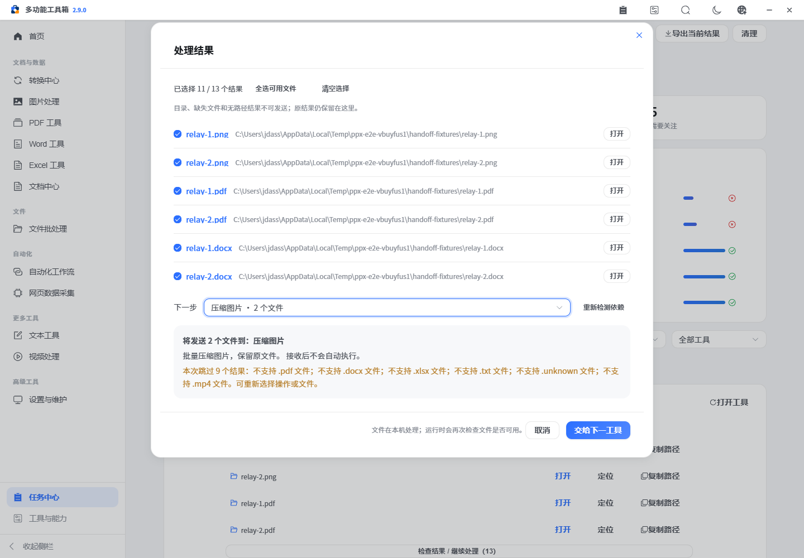
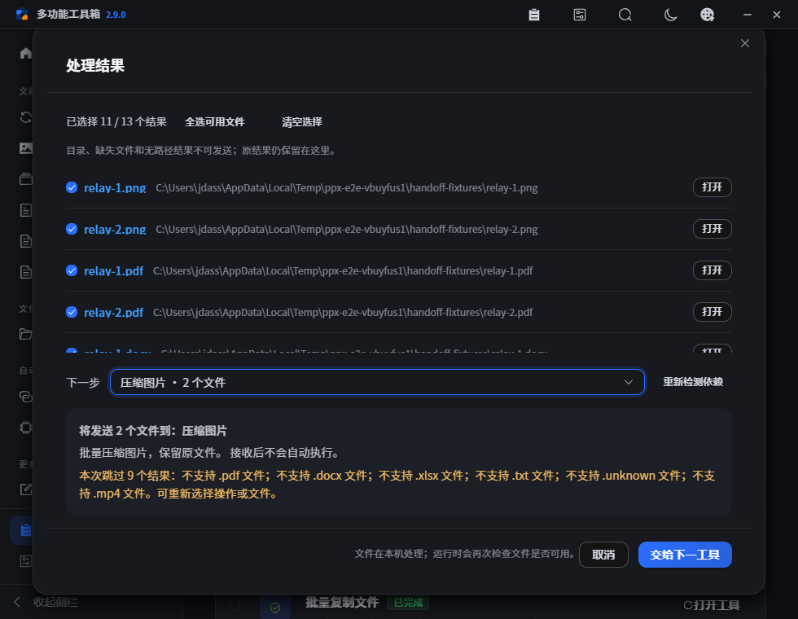

# PPX v2.9.0 — 结果接力

本版将已具备的工具连成可检查的处理流程。文件处理完成后，在“检查结果 / 继续处理”里勾选结果、选择兼容操作，检查发送数量和跳过原因，再在目标操作的主文件输入接收。接收不会自动运行任务。

## 已完成

- 15 个具体接力目标已实现：图片压缩/水印/旋转；转换中心的通用转换/图片合成 PDF/合并 PDF；PDF 压缩/OCR/合并；Word 合并；Excel 合并；文档索引；文件归档；视频压缩/截取。
- 推荐根据真实路径的扩展名、文件数量和接收能力计算。清空选择不能发送；目录、已知缺失项不可发送；不兼容或重复结果明确计入跳过说明。
- 批量主输入追加并按平台路径规则去重；单文件操作在发送前说明替换当前源文件，保留其它参数。超出单文件限制时不默默接收第一项。
- 去掉文件对话框的全局接力拦截。水印图片、其它模块及其它操作的选择器不会吞掉待接收结果。
- 模块关闭或已知依赖不可用时禁用目标，支持重新检测；依赖未知会明确提示，目标工具运行前继续检查。
- 修复保活页面重复返回相同子功能时的定位，提供返回目标与取消接收。
- 移除启动时的远程字体请求，使用本机字体回退；页面语言设为简体中文。
- 完成[工具箱整体设计](../toolbox-design.md)：14 个模块、目标用户、输入输出、异常、优先级、依赖与扩展边界。

## 使用示例

1. 图片压缩完成 → 添加图片水印 → 检查并运行 → 图片合成 PDF。
2. 勾选一份扫描 PDF → PDF OCR → 检查文本或可搜索 PDF → 建立文档索引。
3. 勾选多个 XLSX 结果 → 合并 Excel → 检查字段映射并运行 → 打包归档。

原生 PDF 合并支持每份文件的页码范围，转换引擎合并处理完整文件；两者在操作列表中明确区分。普通 DOC 文件先到转换中心转 DOCX，单表质检/清洗仍从对应模块选择文件。

## 验证范围

| 验证 | 方式与范围 |
| --- | --- |
| 前端静态检查、生产构建 | `pnpm -C gui run lint` / `pnpm -C gui run build` |
| Python 静态检查与回归 | `pnpm run lint:py` / `pnpm run test`，65 项现有回归 |
| 接力规则 | `pnpm run test:gui`，11 项扩展名、混合输入、目录/缺失、路径去重、数量限制等测试 |
| 浏览器集成 | `pnpm run test:e2e`，真实图片处理/重试、PDF 页面处理、工作流、网页采集；另用临时真实文件和隔离的历史记录夹具验证接力接收，缺失可选依赖时验证禁用状态 |
| 发布 | 提交与推送后使用单一 `v2.9.0` 标签触发 GitHub Actions；三平台检查、打包成功后自动创建 Release |

2026-09-08 本地验证通过：前端静态检查无错误（存量风格告警仍保留）、Python Ruff 通过、65 项 Python 回归及 11 项接力规则测试通过，完整浏览器流程通过且无页面异常。15 个目标中，14 个完成真实页面接收验证；本机 OCR 依赖缺失，`pdf/ocr` 验证了不可用时的禁用与说明。测试还确认接收不会新增执行任务，重复归档接收不重复队列，980×760 短窗口中跳过说明与底部操作均可见。

[本地验收明细](assets/v2.9.0/verification.json)记录真实执行与接收夹具各自的覆盖范围，不把接收入口验证等同于所有格式、编码器的完整处理验收。GitHub Actions 另在 Windows、macOS、Linux 运行检查与打包。

## 当前未完成

- 单表质检/清洗的直接接力、接力来源追踪、从人工链路生成工作流模板和跨模块参数映射留待后续阶段，优先稳定统一输入契约。
- 已知不存在的文件会被过滤；存在状态未知的路径需在实际执行时由模块再次检查。
- Windows/macOS/Linux 的真实安装、原位升级、恢复、异常退出及所有文件变体的完整人工验收沿用旧版本的 pending 状态，详见[验收记录](../refactor-acceptance.json)。自动化源码验证和打包成功不能替代这些原生场景。
