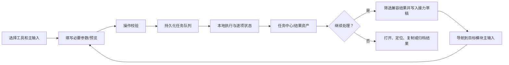

# PPX 统一工具箱设计方案（2.13.0 阶段）

## 1. 定位、目标与设计约束

PPX 是面向日常办公人员的**本地优先桌面工具箱**：把图片、文档、表格、音视频、文件整理与自动化中高频的“输入—处理—检查结果—继续处理”收进同一工作台。它不以堆叠孤立小工具为目标，而以可追溯的本地处理链路减少文件来回选择、重复配置和结果丢失。

本阶段（2.13.0）在常用模板上补齐执行前的只读配置检查和可解释续跑：缺失输入、错误类型及错误步骤引用先定位，检查通过后保存当前配置并执行；恢复时分别展示本次处理与沿用成果。继续复用任务、操作、输出、工作区和工作流引擎，不增加运行依赖。

设计目标：

1. **本地、可控、可恢复**：文件默认不离开电脑；危险文件操作保持预览、回收或撤销边界；处理结果可定位、可重试。
2. **一条主路径清楚可见**：先选择输入、再设置少量必要参数、提交任务、检查输出、按需接力；高级参数渐进显示。
3. **优先复用专业能力**：格式互转归转换中心，文档页面处理归 PDF 工具，表格处理归 Excel。已有 PDF 合并保留两种明确选项：原生工具可设置每份文件的页码范围，转换中心通过其引擎合并完整文件；接力不新增第三套实现。
4. **可扩展而不失控**：模块通过统一 `operation / task / output` 契约协作；接力规则是显式注册的兼容关系，不根据文件名猜测业务意图。
5. **克制的桌面交互**：延续现有 Atelier Paper、Element Plus、主题变量、左侧子工具栏和紧凑信息密度；状态、失败原因、输出位置优先于装饰。

### 目标用户、场景与边界

| 用户 | 高频场景 | PPX 提供的价值 | 不在本阶段范围 |
| --- | --- | --- | --- |
| 行政、运营、财务与项目助理 | 批量整理附件、压缩、转格式、合并 PDF/表格 | 少切换软件，过程与输出可追踪 | 在线协同编辑、云盘同步 |
| 文档归档与知识管理人员 | 扫描件识别、表格提取、全文检索、归档 | 本地 OCR、增量索引与可继续处理的结果 | 替代专业 DMS、自动法律/财务结论 |
| 内容与媒体处理人员 | 图片压缩、水印、拼接、视频截取 | 常规批处理与可选 FFmpeg 能力 | 专业视频剪辑、非线性时间轴 |
| 数据整理人员 | 表格 OCR、清洗、分组、合并、质检 | 统一输入和输出，保留公式处理选择 | BI 建模、多人实时数据治理 |
| 轻量自动化用户 | 对目录或周期任务复用步骤、采集网页导出 | 白名单工作流、触发器与运行记录 | 任意脚本执行、绕过网站权限或验证码 |

边界：PPX 处理用户有权访问的本地文件；网页采集需用户自行处理站点授权、登录和规则。印章功能只生成图像，不能被描述为数字签名。转换中心内置 FlyingMouse Format 上游引擎，必须保留其作者和许可归属。

## 2. 工具箱结构

共享工作台贯穿下列 14 个模块：导航与全局搜索发现能力，模块中心检查可选依赖，工作区保存非敏感草稿，任务中心保存队列/历史/输出，结果操作把兼容资产送入下一个模块。各模块保留自己的专业参数和预览，公共层不接管其业务逻辑。

| 模块 | 主要职责 | 当前代表动作 | 与其他模块的协作 |
| --- | --- | --- | --- |
| 转换中心 | 多格式互转与合成 | 通用转换、图片合 PDF、合并 PDF | 接收多类文件；向文档、图片、PDF、归档输出 |
| 图片处理 | 图片批处理与 OCR | 压缩、水印、裁剪、拼接、OCR | 图片可接力为 PDF、OCR 文本或继续加工 |
| PDF 工具 | 页面、文本、OCR 与安全副本 | 合并、拆分、压缩、OCR、脱敏 | PDF 可转 Word/图片/索引，也可继续压缩或合并 |
| Word 工具 | Word 拆分、切割、合并 | 按标题/页拆分、范围切割、合并 | 依赖 LibreOffice 的真实页码；产物可索引或转换 |
| Excel 工具 | 表结构、清洗、拆分、合并、质检 | 数据质检、清洗、按列拆分、合表 | 接收 OCR/采集输出，形成可检查数据集 |
| 文档中心 | 本地全文索引与表格 OCR | 建立索引、搜索、表格 OCR | 将扫描表格转为 Excel/CSV，再交 Excel 处理 |
| 文件批处理 | 搜索、整理、归档与可恢复操作 | 分类、复制、重命名、查重、压缩 | 为其他模块提供受控的输入集合和最终归档 |
| 自动化工作流 | 白名单动作编排与触发 | 编排、定时、目录监听、历史 | 复用操作目录与任务记录，不绕开单工具校验 |
| 网页数据采集 | 点选字段、翻页、导出 | 正式采集、Excel/Word 导出 | 导出结果进入 Excel 清洗、文档索引或归档 |
| 文本工具 | 小型本地文本诊断与变换 | JSON、去重、替换、Diff、JWT 诊断 | 接收文本内容，不把任意文件处理伪装成文本编辑 |
| 视频处理（可选） | 常规媒体压缩、截取、音频提取、合并 | 压缩、截取、提取音频、合并 | 依赖 FFmpeg/ffprobe；成品可再转换或归档 |
| 印章图片生成 | 生成透明 PNG 图章素材 | 圆形/椭圆图章导出 | 产物可作为图片水印的辅助输入，不自动占用主接力输入 |
| 设置与维护 | 健康、备份、恢复、诊断 | 依赖检查、备份恢复、诊断报告 | 向模块中心暴露依赖状态，保障任务数据恢复 |
| 系统诊断（高级） | Windows 只读系统观察 | 启动项、进程查看 | 与文件处理解耦，结束进程仍需确认 |

## 3. 模块详细设计

下表以当前操作目录、工具注册与接收面板为依据；仅在明确注册的主输入开放文件接力。

| 模块 | 输入 | 处理与输出 | 异常与安全边界 | 依赖/接力 |
| --- | --- | --- | --- | --- |
| 转换中心 | 单个或混合文件、按格式/文件目标、输出目录 | 调用本地格式引擎；输出转换文件、合成 PDF 或合并 PDF | 不支持格式按文件报告；单项失败可形成部分成功；不得把上游引擎标为自研 | FlyingMouse；已接力：通用转换、图片合成 PDF、完整 PDF 合并 |
| 图片处理 | 多图主队列；裁剪为单图；水印图/字体为辅助输入 | 压缩、水印、旋转、裁剪、拼接、命名、OCR，输出新文件/文本 | 尺寸、格式和写入失败明确反馈；重命名先预演，避免覆盖 | 当前已接力：压缩、水印、旋转；主队列只能由声明的路由消费，水印辅助输入不得吞掉接力结果 |
| PDF 工具 | 单 PDF、多个 PDF、页码范围、密码/安全参数 | 页面重排、合并、拆分、压缩、OCR、提取、加密/脱敏，输出新文件或多文件 | 密码错误、页码越界、源文件变化、写入失败；脱敏是永久副本，先确认预览 | 已接力：多 PDF 合并、单 PDF 压缩与 OCR；OCR 需本机运行时 |
| Word 工具 | 单/多 DOCX、拆分模式、页码范围 | 按标题/段落/页拆分，范围切割，多文件合并 | 页码、源文件、布局或写入失败需反馈 | LibreOffice 用于真实页码，合并不要求该依赖；已接力：Word 合并，输出可索引或转换 |
| Excel 工具 | 单表、多个工作表/文件、表头行、字段映射、公式策略 | 原始质检、保留类型的清洗与样本比较、分组拆分、合并与质量报告 | 表头/映射不匹配、缓存公式不可用、写入失败定位到字段或文件；换文件/工作表后清除旧字段和结果，丢弃旧异步响应 | 已接力：单份 XLSX/XLSM/XLTX/XLTM 质检、清洗、拆分；多份工作簿合并 |
| 文档中心 | 目录或单文件、扩展名、OCR 开关；图片/PDF 表格 | 增量索引、全文搜索、表格 OCR 导出 Excel/CSV/JSON | 源文件缺失、变化、索引过期需提示；OCR 低置信度需人工核对 | 已接力：PDF/Word/Excel/文本索引；只有启用识别的处理需要 OCR |
| 文件批处理 | 目录、筛选条件、规则、压缩项 | 搜索、分类、复制、删除、重命名、查重、压缩解压 | 删除预览且可回收；重命名/分类记录事务并支持撤销；冲突按策略处理 | 已接力：任意文件打包归档；目录不进入文件接力，仍可在模块内单独添加 |
| 自动化工作流 | 内置模板、已校验动作、参数、前序输出引用、触发器 | 当前参数保存后执行；顺序串联、部分成功策略、重试/退避、逐步结果、历史、监听与定时 | 新模板部分成功停止；失败续跑仅复用仍存在且签名一致的成功产物；触发器排除自身输出 | 复用 operation 与 task；4 个内置模板，不接收任意脚本 |
| 网页数据采集 | 用户点选字段、翻页规则、最大页数/条数、结果编号 | 采集记录与 XLSX/DOCX 导出 | 登录失效、动态页面、详情失败、限额需明确显示；只重试失败请求 | Playwright；XLSX 导出可通过任务结果进入 Excel 质检/清洗 |
| 文本工具 | 直接输入文本、JSON、替换规则、对比文本 | 格式化、转换、去重排序、批量替换、差异/JWT 诊断 | 语法错误、规则不合法本地提示；JWT 仅结构与时效诊断，不上传、不写任务历史 | 无外部依赖；不作为文件结果的默认接收器 |
| 视频处理 | 单视频（压缩/截取/音频）或多视频（合并）、编码参数 | 压缩、截取、提取音频、合并，输出媒体文件 | 无 FFmpeg/ffprobe、时间范围错误、编码不兼容、磁盘不足需先阻止或诊断 | 已接力：单视频压缩、截取；需先开启视频模块并准备 FFmpeg/ffprobe |
| 印章图片生成 | 模板、文字、样式、输出目录 | 生成透明 PNG，预览与导出保持同一渲染 | 字体/输出失败反馈；不承诺签名或法律效力 | 可作为图片水印辅助文件；不触发自动水印 |
| 设置与维护 | 检查请求、备份包、恢复包 | 依赖状态、完整备份、延迟安全恢复、隐私诊断 | 恢复前校验，失败回退；旧备份标识校验等级 | 提供模块可用性；依赖不可用时接力入口应说明原因 |
| 系统诊断 | Windows 系统查询/用户确认的进程操作 | 只读启动项、进程资源；确认后结束进程 | 非 Windows 隐藏；终止进程必须确认且报告结果 | 与业务处理无直接接力关系 |

## 4. 核心流程与结果接力规则

### 4.1 基础使用流程



示例：

1. **PDF → OCR → 索引**：在结果中只选一份 PDF，选择 PDF OCR，点击目标主输入接收并运行；检查可搜索 PDF/文本输出，再选择“建立文档索引”，添加文件后点“更新索引”。每一步都可单独检查结果。
2. **图片压缩 → 水印 → 合成 PDF**：结果交给图片水印，接收会追加队列并去重；设置水印后手动运行。成功图片再交给“图片合成 PDF”，检查排序与输出位置后生成。水印图选择保持独立，不会误接收主队列。
3. **表格 OCR → Excel 清洗/合并**：单份工作簿交给“清洗 Excel”，接收主文件，确认表头行、公式策略和去重字段，比较样本后导出；多个 XLSX 输出可接到“合并 Excel”，展开分表确认字段映射。CSV/JSON 仍需先转换为支持的工作簿格式。
4. **采集导出 → 质量检查 → 拆分**：XLSX 结果交给“Excel 数据质检”，手动开始分析或导出报告；需要分发原数据时将对应数据文件交给“拆分 Excel”，选择分组列后导出。质量报告是单独产物，不能当成原数据隐式传递。

### 4.2 接力交互与数据规则

1. 结果弹窗先列出输出资产及不可发送项。目录、`exists:false`、空路径结果不可发送，并直接显示原因。
2. 操作列表随所选文件实时变化；模块关闭或依赖已知不可用的兼容操作禁用并显示原因，未知依赖明确标为尚未确认，支持重新检测。
3. 路由按真实路径扩展名和数量约束过滤：Windows 路径大小写不敏感去重，Linux 保持大小写；未知格式只建议归档；PDF 压缩、PDF OCR、视频压缩/截取、Excel 质检/清洗/拆分为单文件。多文件不建议这些操作，直接调用也不能静默取第一项。
4. 打开结果默认选中可用文件；清空选择会禁用发送。弹窗显示“将发送 N 个”、跳过数量与分类原因，目录和缺失状态在文件行标注。发送只将资产写入内存接力队列并导航，不提交任务。
5. 目标模块仅由其声明的**主输入**调用 `consumeIncomingFiles(routeId)` 消费。隐藏的保活面板、文件选择器和水印等辅助输入不得读取或清空队列。
6. 批量主输入按平台路径规则去重后追加，保留已有排序；单文件操作明确说明会替换当前源文件，保留其它参数。接力资产只在本次会话内保存；原任务历史按原有策略持久保留。
7. 接收页面显示目标操作、待接收数量、返回目标操作与取消入口；手动切换子功能后能返回同一接收目标。接受文件后提示消失，用户仍需手动运行。

本阶段已接通路由表中的 **18 个目标操作**：图片压缩/水印/旋转、转换中心的通用转换/图片合 PDF/合并 PDF、PDF 压缩/OCR/合并、Word 合并、Excel 质检/清洗/拆分/合并、文档索引、文件归档、视频压缩/截取。新增表格链路与验证环境见 [v2.10.0 发布说明](releases/v2.10.0.md)。

### 4.3 Excel 处理契约

| 操作 | 读取与处理规则 | 输出与异常 |
| --- | --- | --- |
| 结构与质检 | 明确传入表头行、工作表、公式策略；质检和拆分不继承清洗去重设置 | 结构样本、完整行数/列画像、质量报告；文件不可读或公式无缓存时显示持久错误 |
| 清洗比较 | 主文件最多 100 行样本；保留日期、数字、字符串和公式元数据，使用与导出相同的去空格、去重、排序逻辑 | 前后样本、样本删除数；明确不包含附加分表，不承诺等同全表去重或排序 |
| 完整处理 | 主文件与附加分表先按字段映射合并，再去空格、按指定字段去重、排序、分组；空值排序置后 | 新 XLSX、分组文件、可选图表 JSON；显示输入行数、输出行数、去重删除数 |
| 分表合并 | 按第一份表的字段结构，逐表检查映射；共享表头与公式规则显式传给每次调用 | 新主表，去空格对输出生效；缺失字段在错误中定位到文件 |
| 输入变化 | 替换主文件或更改工作表/读取规则时递增版本，清空旧字段、比较及结果；处理规则变化清除结果 | 迟到响应不得覆盖新输入；输出目录保留，重新读取也不保留旧分析结果 |

输出为新的 `.xlsx` 数据表，不保留宏。公式保留仅支持本行相对引用，并随行移动调整；跨行、跨表、绝对引用和命名区域应先在 Excel 中计算并保存，再选择缓存值策略。预览不是公式计算器。

### 4.4 直接来源与任务协作

- 发送结果时附带来源任务 ID 和输出路径；主输入接收后保留在文件对象上。预览不丢弃来源，移除或重新本地选择文件会改变对应对象，不通过全局路径缓存猜测来源。
- 执行点把实际使用的主文件对象显式交给 `callTaskApi`。输入来源位于任务提交顶层，与业务参数分开；操作目录用 `primaryInputFields` 声明主输入，辅助水印、字体、目录和附加表不自动纳入。
- 后端验证本次主路径与来源任务文件输出一致，生成来源操作/时间快照；最多 200 项候选来源，超出或无效信息明确提示，不阻止正常文件处理。
- 任务中心可以逐层查看来源，父记录不在当前筛选或分页时通过 `task_get` 读取。重试关系单独展示；来源任务清理后已验证关系保留，部分失败重试仅复制剩余输入的关系。
- 来源元数据随任务保存于本机数据库并进入 JSON/CSV 历史导出，不进入工作区参数配置。它只表示路径级明确使用关系，不验证外部文件内容变化。

实现与验收证据见 [v2.11.0 发布说明](releases/v2.11.0.md)。

### 4.5 可复用工作流

| 模板 | 本次输入 | 模块协作与输出 | 默认失败策略 |
| --- | --- | --- | --- |
| 图片压缩 → 归档 | 图片列表、输出目录、压缩包名；质量可在步骤内调整 | 图片 `image_batch_compress.outputPaths` → 文件 `file_compress.items`；生成图片副本和 ZIP | 错误或部分成功均停止，不归档不完整的一组文件 |
| Excel 清洗 → 质检报告 | 工作簿、输出目录、原表表头行、去空格开关、去重字段 | `excel_process.combinedPath` → `excel_quality_report.filePath`；生成清洗表与质量报告 | 先成功生成清洗表，再检查副本；报告固定从新表第 1 行读取 |
| 扫描 PDF → OCR → Word（已有） | 扫描 PDF、输出目录 | OCR 生成可搜索 PDF，再转 Word | 沿用既有错误停止规则；需要可用 OCR 依赖 |
| 图片水印 → 压缩（已有） | 图片、输出目录、水印文字 | 先添加水印再生成分享副本 | 沿用原策略，可在编辑器选择部分成功时停止 |

使用模板只创建可编辑工作流，不运行文件处理或启用触发器。用户填写“本次运行”后立即运行；提交前验证并保存当前编辑，避免使用旧步骤。执行期间禁用参数编辑；运行后可从每一步结果继续接力，来源关联使用已存在的队列任务。

`onPartial` 与 `onError` 独立：旧工作流缺省 `continue`，新模板为 `stop`。停止后不删除成功产物；修复失败输入后从任务中心重试，以原运行 ID 和步骤签名复用成功项。步骤变更或成功产物丢失时不沿用旧结果。空的可选密码不影响重试，非空敏感参数继续脱敏并禁止不完整重试。

Excel 去重字段留空表示不去重，报告检查清洗后的副本；原始质量需要在清洗前单独分析。工作流数据按现有本机持久化与模板包方式保存，导出分享前应检查参数中的路径和敏感值。详情见 [v2.12.0](releases/v2.12.0.md)。

### 4.6 执行前检查与恢复契约（2.13.0）

1. “检查配置”读取当前步骤、运行输入和手动监听信息，仅做结构、已知参数类型及绑定检查，不保存、不入队、不读取文件内容。立即运行先做同样检查，通过后保存并执行；新建工作流也适用。
2. 错误包含步骤索引、字段路径和原因。文件来自 `input` 时定位到“本次运行”的实际输入控件；高级 JSON 可在对应步骤修正。输入变更清除报告，迟到响应不能覆盖新配置。
3. 输入变量按实际运行语义只替换一次，完整绑定保留列表、数字和开关类型。只允许引用前序步骤，自引用、未来步骤和未知来源报错；前序自定义结果内容尚未产生时列为待执行核对，不虚构可用字段。
4. 单次检查最多 100 步、1000 处引用、10000 节点、12 层及 200 万字符；变量展开共用体积预算。最多展示 100 条错误，但总数和每步有效性独立统计，超限不执行。
5. 续跑持久记录来源运行 ID。部分步骤显示实际已记录的本次输入数、沿用成功输入数和未重新生成的沿用输出数；旧记录缺数据时保留未知。完整复用步骤明确说明本次未执行。
6. 工作流步骤签名不一致、任何先前生成的输出被移动或删除时拒绝续跑，包含部分成功步骤的产物，避免静默少文件。重新运行仍保留原有输入选择和业务冲突策略。

预检不是文件可读性、磁盘空间或可选依赖的执行保证；这些条件仍由业务操作在实际运行时核对。已有定时和目录监听的自动注入语义保持兼容。实现与验证见 [v2.13.0](releases/v2.13.0.md)。

## 5. 优先级、可行性与成本

| 优先级 | 范围 | 价值与实现策略 | 复杂度/维护成本 |
| --- | --- | --- | --- |
| P0（已完成基线） | 结果资产规范化、兼容路由、结果选择与跳过说明、主输入精确消费、草稿保留 | 直接消除“处理完再找文件”的高频摩擦；复用操作目录、任务中心与工作区 | 中等；重点维护路由与面板输入契约的一致性 |
| P0（2.10.0） | 18 条接力链路、Excel 类型一致性、读取规则隔离与陈旧响应处理 | 补齐单表质检、清洗、拆分高频工作流，保证样本与真实导出采用一致规则 | 中等；以真实工作簿、交错请求和短窗口验证 |
| P0（2.11.0） | 主输入直接来源、历史查看、重试保留与清理后状态 | 复用现有任务 JSON 和操作目录，把已确认的人工处理链路变得可检查 | 中等；不建立独立图存储，按需读取父任务，限制候选来源数量 |
| P0（2.12.0） | 图片归档、表格清洗质检模板；当前参数执行、部分成功停止、结果查看和可靠续跑 | 高频、通用、跨模块的重复处理可以从模板复用；仅补齐现有引擎契约与界面 | 中等；新增模板为数据配置，以真实 ZIP/XLSX 与失败恢复验证，不新增运行依赖 |
| P0（2.13.0） | 只读预检、错误定位、检查结果失效、可解释续跑计数和缺失成果阻断 | 将可提前发现的错误移到运行前，恢复结果可核对 | 中等；共用绑定解析和操作校验，有限预算与真实浏览器验证 |
| P1 | 更完整的复杂表格质量提示及真实采集/OCR数据验收 | 基础格式、单表输入已支持；进一步覆盖复杂文件需要实际样本和依赖环境 | 中等；明确自动验证覆盖范围 |
| P1 | 从人工接力自动生成工作流、完整来源索引 | 常用模板与手动编辑已支持；自动还原链路需明确参数取舍与来源完整性 | 中等偏高；避免复制过期路径、密码或隐含规则 |
| P1 | 操作目录、任务名单与工作流白名单的契约对齐 | 对 `operation_catalog`、`TRACKED_METHODS`、`WORKFLOW_METHODS` 和输出字段建立一致性校验，减少新增动作时遗漏注册 | 中等；先验证数据结构，再逐步合并重复元数据 |
| P2 | 基于用户选择的链路推荐、工作流模板推荐 | 可减少发现成本，但只能解释推荐原因，不能替用户执行 | 高；要避免黑箱推荐与过度提示 |
| P2 | 跨模块批量参数映射、可审阅的接力预设 | 面向成熟用户，适合稳定模板后引入 | 高；字段语义、版本兼容和维护成本较高 |

不纳入近期范围：通用“AI 自动决定下一步”、任意文件的隐式转换、跨模块自动执行、重复建设另一个队列/工作流系统、把辅助输入错误替换为处理结果。这些做法要么不可解释，要么破坏用户已有草稿和安全边界。

## 6. 技术实现建议与模块协作契约

### 6.1 统一契约

已有后端以版本化操作目录描述 `id/tool/feature/fields/batchKey`，并在操作执行后补齐 `outputAssets`、`outputPaths`、`outputDir`。继续扩展时应保持以下结构：

```text
operation: { id, tool, feature, fields, batchKey, dependencies, inputTypes, outputTypes }
task:      { id, method, status, inputItems, itemResults, outputs, diagnosis, retryOf, inputOrigins, inputOriginWarnings }
asset:     { path, name, kind: file|directory, exists, size }
handoff:   { routeId, assets: [{ ...asset, origin: { sourceTaskId, sourceAssetPath } }] }
inputOrigin: { inputPath, sourceTaskId, sourceAssetPath, sourceMethod, sourceCreatedAt, validation, sourceAvailable }
```

来源记录现已实现；`sourceAvailable` 在任务快照中动态计算，来源 ID、路径与后端摘要持久保存，不复制完整敏感参数。`routeId` 稳定为 `tool/feature`；接收面板明确主输入，操作目录声明 `primaryInputFields`，路由声明可接受扩展名、最小/最大文件数和依赖。目录、预览数据、纯文本结果和已知不存在路径不作为文件接力资产。

### 6.2 执行、状态与错误

- 提交前用 `operations_validate` 校验必填字段、类型、数值和枚举值；模块补充文件格式、页码、权限等业务校验。
- 耗时动作继续走持久化单工作者队列；状态使用 `queued/running/canceling/success/partial/failed/interrupted/canceled`，逐项结果用于部分失败重试。
- 批量输出先写临时位置，成功后提交；命名冲突自动避让。接力过滤已知缺失项，`exists:null` 不等于已核实存在，实际执行时由模块再次检查路径；纯文本内容不被当作文件路径。
- 依赖状态来自模块中心/操作目录：转换中心对应 FlyingMouse，视频对应 FFmpeg/ffprobe，OCR 对应 RapidOCR，Word 真页码对应 LibreOffice，采集对应 Playwright。依赖未满足时，应禁用发送按钮或说明原因，而不是清空用户结果。
- 接力路由单独可测试：混合扩展名、重复路径、Windows/Unix 大小写、目录、缺失文件、单文件限制和最小文件数都应有案例。接收面板还要验证只有主输入消费队列。

### 6.3 工作流的关系

结果接力服务于临时、可审阅的两三步人工链路；工作流服务于稳定、重复、可配置触发的链路。用户可以从内置模板创建，或按已经确认的处理顺序手动编排。工作流继续使用白名单操作、前序输出引用、步骤签名检查、失败续跑和触发器自身输出排除，不从前端接力队列直接绕过校验。

## 7. 迭代检查与扩展方向

后续每轮新增接力或模块时，按以下检查：是否已有同类入口；接收的主输入是否明确；多文件语义是否安全；依赖、错误和撤销是否可解释；是否可由现有 operation/task/output 复用；是否会让用户误以为已自动执行。

可扩展方向：

1. 在已支持的 18 条链路上补充更多真实采集/OCR文件变体验收，并把“不可用原因”统一为模块状态提示。
2. 直接来源已支持，下一步评估来源去向索引与将已确认人工链路保存为工作流模板。
3. 为输出资产增加可选 MIME/格式探测缓存、哈希或生成来源，但保持本地且避免全量扫描性能负担。
4. 增加模板化质量门：例如 OCR 后提示低置信度页、采集后提示空列/重复值、PDF 合并前提示页数与顺序；提示只辅助检查，不替代业务判断。
5. 在真实用户数据验收后，再考虑基于历史手动选择的可解释推荐；推荐必须可关闭、可查看理由、不得自动发起任务。

## 8. 当前完成状态与验收范围

### 已完成或已存在的基础

- 14 个工具模块已在前端统一注册，包含模块、功能、关键词、可选依赖与平台限制。
- 后端已有 61 个操作的版本化字段目录、操作参数校验、批量逐项执行、统一 `outputAssets` 补齐和持久化任务队列。
- 工作区已有非敏感草稿保存、文件队列合并与路径去重；任务中心已有输出、部分失败、诊断、取消和重试基础。
- 已接通 18 个接力目标：过滤目录、已知缺失、空路径、重复路径、不支持类型和超出单文件限制的输入；混合结果明确显示发送范围。
- Excel 单表处理拥有明确主输入；样本与完整导出共用保留类型的变换；质检/拆分/合并显式传递读取规则；快速换文件丢弃旧响应，结果路径支持短窗口换行和键盘操作。
- 18 个目标执行点及质检报告显式传递来源；来源与业务参数分离，后端验证、持久化、重试过滤和来源查看已完成。
- 新增两个常用模板并复用已有两个模板；当前编辑保存后执行、部分成功策略、逐步结果接力、补齐失败输入后续跑与无密码归档重试已完成。
- 工作流只读配置检查、运行前阻断、错误定位、配置变更失效、续跑来源及计数、部分成果缺失阻断已实现，不新增后台服务或运行依赖。
- 已移除文件对话框全局劫持，接收只发生在声明路由的主输入；辅助输入、其它模块和其它操作不消费队列。接收与执行分开。
- 已移除启动时的 Google Fonts 远程请求，使用本机字体回退，避免离线或慢网环境等待远程字体；页面语言标识设为简体中文。

### 未完成及原因

- 从失败明细构造新队列等增强接力尚未实现：当前优先保证已有工作流与续跑可靠，避免把不同字段模型强行合并。
- 从人工接力自动生成工作流、内容级来源校验、辅助文件来源、可解释推荐和跨模块复杂参数映射尚未实现，按高频价值继续迭代。
- 旧的跨平台真实安装、升级、恢复、异常退出和逐功能真实数据验收仍为 pending。已有源码/构建与关键链路验证不能替代 Windows、macOS、Linux 的安装后人工验收，也不能覆盖真实登录网站与所有办公/媒体文件变体。

当前工作流检查与恢复验证见 [v2.13.0 发布说明](releases/v2.13.0.md)，模板见 [v2.12.0](releases/v2.12.0.md)，来源见 [v2.11.0](releases/v2.11.0.md)；表格与接力基线见 [v2.10.0](releases/v2.10.0.md) 和 [v2.9.0](releases/v2.9.0.md)。缺失依赖和原生安装场景单独保留，不并入通过项。
